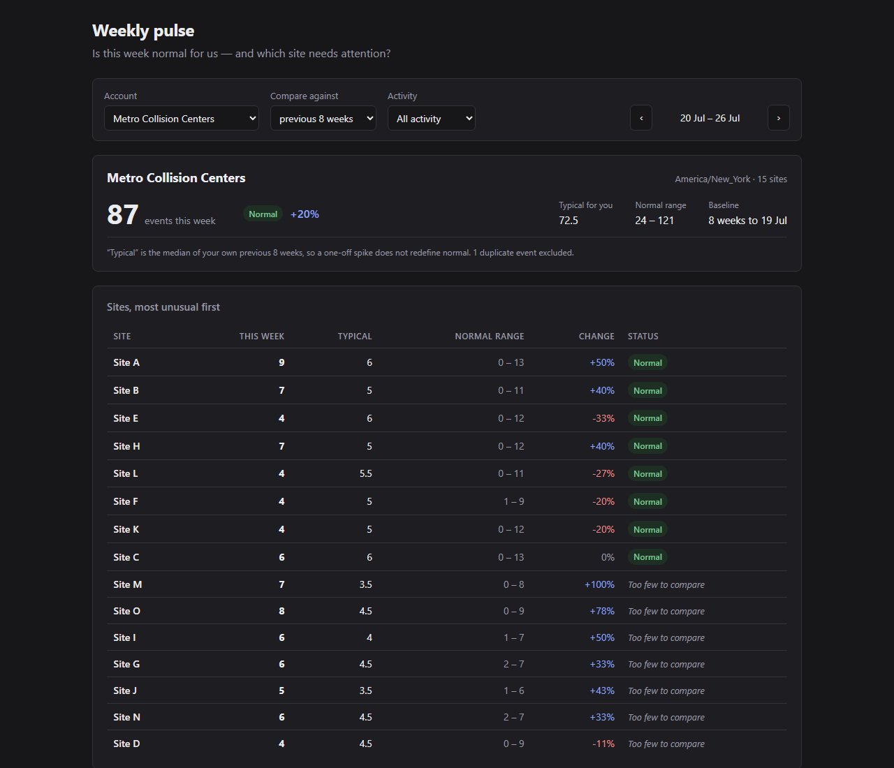
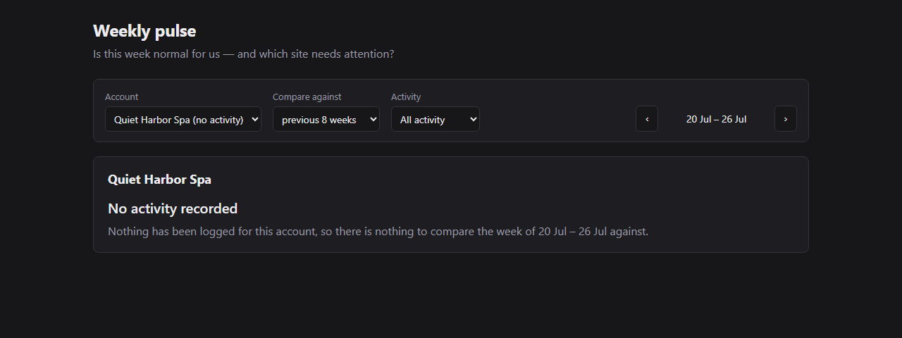

# DASH-247 — Weekly pulse

> *"Is this number normal for us?"* answered on one screen, with the site that needs
> attention at the top of the list.



---

## Running it

Needs Docker, the .NET 8 SDK (or newer — SDK 9/10 build this fine) and Node 20+.

```bash
docker compose up -d --wait                       # SQL Server 2022 on host port 11433
dotnet run --project backend/src/Relay.Api        # http://localhost:5080  (Swagger at /swagger)
cd frontend && npm install && npm start           # http://localhost:4200
```

The API applies its migrations and loads `seed.sql` on first start — no separate seed step,
and re-running is a no-op. First start takes a few seconds while 12,626 events load.

These commands were run against a fresh clone into an empty directory, from a new empty
database volume, with nothing else configured. No extra steps were needed. (Same machine,
so the prerequisites above were already installed — that part is untested.)

**Tests** — backend needs the database up:

```bash
docker compose up -d --wait
dotnet test backend/Relay.sln                     # 45 tests
cd frontend && npm test -- --watch=false --browsers=ChromeHeadless   # 10 tests
```

Nothing else to configure. The connection string is in `appsettings.json`; override it with
`ConnectionStrings__Relay`, or `RELAY_TEST_CONNECTION` for the tests.

---

## How I read the ticket

The ticket asks for two things that sound separate and are not:

- *"is this normal for us?"* — self-relative, not benchmarked against other Relay customers.
  Nobody asked to be compared to anyone else, and 20 accounts across 8 industries is not a
  peer group.
- *"multi-location customers matter"* and, from the background doc, *"struggle to spot which
  location needs attention"*. Two separate mentions. An account-level roll-up alone fails
  the ticket.

And one constraint that fixes the shape: *"a customer admin should be able to look at this
Monday morning and act on it."* That means a **weekly** cadence, the week that **just
ended** rather than week-to-date, and an ending in an **action** — which for a
multi-location customer is "go look at Site D", not "you are down 6%".

So: **one screen**. The last complete Monday–Sunday week, the account total against its own
recent norm, and every location ranked by how far it sits from *its own* norm.

Full reasoning, the open questions I proceeded on, and four amendments made before and
during implementation are in **[PLAN.md](PLAN.md)**. It is left as written.

## What "normal" means here

```
current      = events in the last complete Mon–Sun week, in the account's local time
baseline     = MEDIAN of the previous N complete weeks        (N = 4 | 8 | 12, user-selected)
spread       = MAD of those weeks, scaled                      (fallback √median if MAD = 0)
typical band = baseline ± 2 × spread
```

**Median rather than mean, because the data proves the cost.** Account 6 has a planted
burst — 805 events on 2026-06-03 against a typical 10.9/day. That week sits *inside* the
default baseline window, so on the default screen:

| | baseline | this week (87 events) reads as |
|---|---|---|
| mean | 171.1 | **−49%, a collapse** |
| median | 72.5 | **+20%, normal** |

A customer whose baseline silently absorbed one spike would be told that six ordinary weeks
running were catastrophic. This is demonstrable on real seed rows, not in a fixture, and
it is pinned by a test.

**Whole weeks rather than rolling windows.** A complete Mon–Sun week holds exactly one of
each weekday, so day-of-week seasonality cancels out for free. That matters here: measured
weekend volume is ~22–23 events/day against ~85 on weekdays. Comparing whole weeks avoids
the problem instead of correcting for it. The cost is that on Monday the freshest data is
up to seven days old — which is the stated workflow.

### The honest bits

Real accounts break the naive version of that formula, so the API and the UI say so rather
than producing a number:

| Situation | In the seed | What happens |
|---|---|---|
| Account with no events at all | Quiet Harbor Spa (20) | Explicit "No activity recorded" panel naming the week. No zeros, no percentage against nothing |
| Baseline median is 0 | none — synthetic test | No percentage at all. Not `Infinity`, not `NaN`, not a fabricated −100% |
| Fewer than 4 prior weeks | none — synthetic test | `insufficientHistory`; counts shown, verdict withheld |
| Baseline median < 5/week | 8 of 69 locations | `lowVolume`; counts and band shown, **no badge**. 5 → 9 is "+64%" and is also noise |
| MAD = 0 | account 12 / Site A | Falls back to √median. MAD collapses when a *majority* of weeks share a value, not only when all do — `[8,8,8,8,3,6,8,14]` has real spread and MAD 0 |
| Weeks with no events | 66 zero-days of 177 for account 16 | Gap-filled with 0 in SQL. `GROUP BY` returns only weeks that exist, and a median over 5 of 8 weeks is wrong while looking fine |



---

## Notable choices, and what they cost

**EF Core only — no Dapper.** The plan originally specified Dapper for the analytics read.
Dropped before writing it ([Amendment 4](PLAN.md)): the actual requirement was *raw SQL*,
not Dapper, and `Database.SqlQueryRaw<T>` runs raw SQL onto a flat DTO with no change
tracking. Two data-access stacks would have meant two connection stories and two config
points for no benefit at this size.

**The aggregation SQL is a file, not a string literal.**
[`WeeklyTotalsByLocation.sql`](backend/src/Relay.Api/Analytics/Sql/WeeklyTotalsByLocation.sql)
ships as an embedded resource. The deciding reason is verifiability — correct aggregates are
what this is judged on, and a query in a file can be pasted straight into a database session
to check its numbers. A query trapped in a string can only be exercised through the app.

**SQL aggregates; C# does the statistics.** SQL goes as far as weekly totals per
`(location, week)` with gaps materialised as zero — real aggregation over 12.6k rows.
Median, MAD, band and status happen in C# over at most ~200 rows
([Amendment 2](PLAN.md)). This was a correction: the original plan put `PERCENTILE_CONT` in
T-SQL, which contradicted its own promise of database-free unit tests, and would have needed
two passes for MAD anyway. The split is what makes the seven statistical branches testable.

**Local dates are precomputed at load, not converted at query time.** `occurred_at` is UTC;
each account has an IANA zone; 67 of 12,626 events (0.53%) fall on a different calendar day
locally. `AT TIME ZONE` rejects IANA ids — [verified against the actual Linux
container](analysis/04_sqlserver_timezone_check.output.txt), not assumed — so the loader
computes `occurred_local_date` and `local_week_start` in C# and indexes them. The zone logic
is an hourly scan in `TimeZoneSegmenter`, unit-tested without a database, and it places the
2026-03-08 DST transition on the exact hour. Trade-off: denormalised, and an account
changing timezone would need a backfill.

**`seed.sql` is never edited.** It is treated as production data, so the schema uses
snake_case names to match it and the file executes verbatim. Idempotency comes from a
hash-stamped marker row in `seed_runs`, not from rewriting the file with guards.

**Filters live in the URL, not in a service or `localStorage`.** The requirement is that
state survives a reload; the URL also makes the view shareable, which is the real use case
— a customer admin sending their account manager a link. `readFilters` validates on the way
in, since a URL is user-editable and a stale bookmark should fall back rather than render an
impossible state.

**No NgRx.** Four query parameters and one HTTP call do not need a store.

**Deduplication.** 12 exact value-duplicates carry distinct ids. Two identical calls at the
same site in the same second is a double write, so they collapse on `MIN(id)` — and the
count is reported in the response and shown in the footnote, rather than rows vanishing
silently.

**The burst day stays in the data.** It is real recorded activity. Deleting rows to make a
metric behave is the worse failure; the robust statistic is what makes it harmless.

---

## Deliberately not built

- **Alerting and ML/forecasting** — out of scope per the ticket.
- **Peer or industry benchmarking** — "normal *for us*" is self-relative.
- **Trend charts.** A line chart shows *change*, not *normality*, and reading "is this
  normal" off one is exactly the work the customer is currently failing to do. It would also
  have eaten the budget that went into the aggregate being right.
- **Drill-down to individual events** — the ticket ends at "act on it".
- **Auth** — per the brief. The account picker stands in for "the account this admin belongs
  to"; in reality it would come from the session and the endpoint would be authorised.
- **Outcome and duration analysis.** `outcome` is null on ~3.2% of rows and
  `duration_seconds` on 4.0% of calls. Neither affects an event count, so both were left
  alone rather than half-handled.

## With another day

1. **A sparkline of the baseline weeks per row.** The single highest-value addition: it
   shows *why* a location is flagged, which the numbers alone do not.
2. **Week-over-week movement of the ranking** — "Site D has been below normal three weeks
   running" is a different and more actionable signal than one bad week.
3. **Server-side paging or virtualisation** for the location table. Fine at 15 sites,
   not at 200.
4. **Make `occurred_local_date` NOT NULL** by computing it in an ingestion path rather than
   in a post-load pass. It is nullable today only because `seed.sql` cannot supply it.
5. **A `?asOf=` parameter** so the "latest week" anchor can be pinned for reproducible
   screenshots and demos.
6. **Property-based tests on the calculator** — the branch table is exactly the shape that
   rewards generated inputs.
7. **Push the duplicate count into the main query.** It is a second round trip today, done
   in LINQ as a diagnostic.

---

## Layout

| Path | What it is |
|---|---|
| [`PLAN.md`](PLAN.md) | The plan, written before any code, plus four amendments |
| [`ai-log/`](ai-log/) | Raw session transcripts and in-the-moment decision notes |
| [`CLAUDE.md`](CLAUDE.md) | Agent rules for this repo — the things an agent gets wrong here by default |
| [`analysis/`](analysis/) | Seed profiling. Every golden number in the tests came from here first |
| `backend/src/Relay.Api/` | Minimal API, EF Core, the aggregation SQL |
| `backend/tests/` | 45 tests |
| `frontend/` | Angular 18, one route |
| `seed.sql`, `schema.sql`, `docs/` | The starter, unmodified |

### Tests, and what they are for

45 backend + 10 frontend. Not chasing coverage — the targets are the things that can be
wrong in ways that matter:

- **Unit, no database**: the seven statistical branches, week arithmetic, DST segmentation.
- **Integration, against the seeded database**: aggregates asserted against numbers computed
  independently in Python in `analysis/` *before any C# existed*. If the SQL and the C#
  agree with each other but disagree with those, the pipeline is wrong — which a test
  written from the implementation would never catch.
- **Frontend**: a component built fresh from a URL rebuilds every filter and requests
  exactly what the URL said. That is what "survives a reload" means mechanically.

Five backend tests failed on their first run. The implementation was right and my arithmetic
in the fixture was wrong. That is the failure mode the approach is meant to produce.
